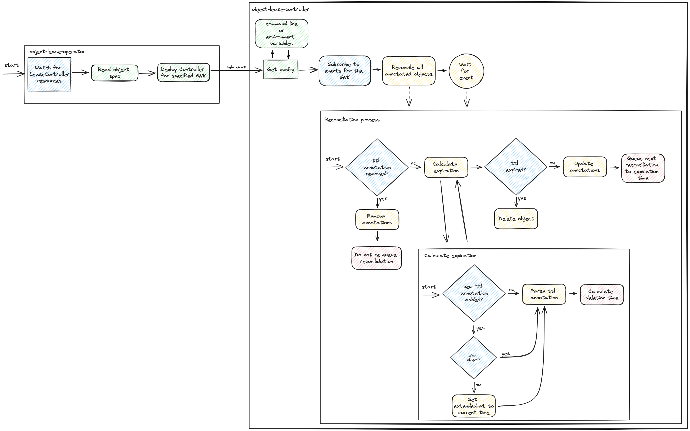
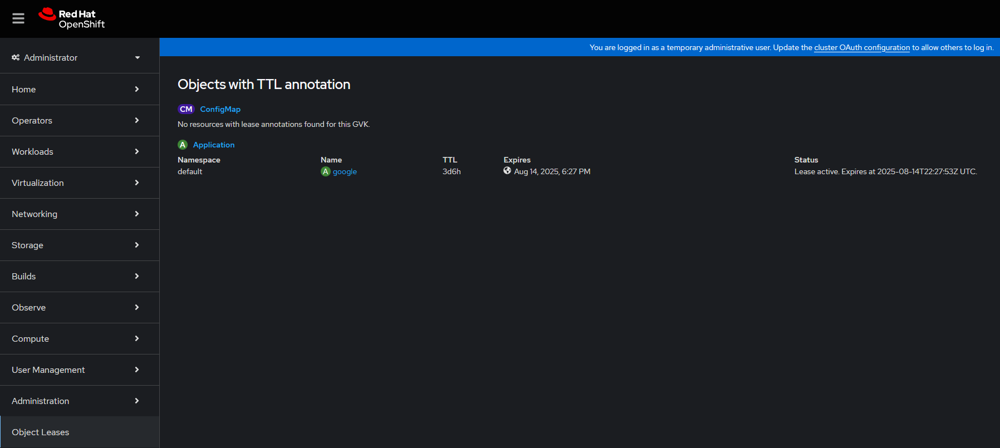

<h1 align="center">Object Lease Operator</h1>
<p align="center">
  <a target="_blank" href="https://github.com/ullbergm/object-lease-controller"></a>
  <a href="https://github.com/ullbergm/object-lease-controller/blob/main/LICENSE"></a>
  <a href="https://codecov.io/gh/ullbergm/object-lease-controller"></a>
  <br />
  <a href="https://buymeacoffee.com/magnus.ullberg"></a>
  <a href="https://ullberg.io/cv.pdf"></a>
</p>

This project implements a Kubernetes operator that allows you to specify a TTL (Time To Live) for an object and once that time passes the object is deleted. The operator dynamically deploys a controller for each Group-Version-Kind (GVK) you configure it to monitor. Each controller watches and manages resources of its assigned GVK, enabling scalable lease management across multiple resource types. The service account for the controller is granted a role the allows it to manage the specified GVK only.

## Features
- Deploys as an operator.
- Dynamically deploys a controller for each configured GVK.
- Controllers are only managing one GVK each, increasing scalability.
- Leader election support for high availability.
- **Admission webhook** for validating TTL annotation format (optional, per-GVK configuration).
- Custom cleanup scripts via Kubernetes Jobs before object deletion.

## Architecture
The operator is designed to be highly extensible and scalable. Once deployed, the operator looks for CRDs and for each GVK specified in a CRD, a dedicated controller is launched.

Each controller:
- Watches for changes to resources of its GVK.
- Manages lease of objects associated with those resources.
- Ensures lease lifecycle (renewal, expiration) is handled appropriately.

## Flow Diagram


## Configuration

### LeaseController
```yaml
---
apiVersion: object-lease-controller.ullberg.io/v1
kind: LeaseController
metadata:
  name: application-controller
spec:
  group: "startpunkt.ullberg.us"
  version: "v1alpha2"
  kind:
    singular: "Application"
    plural: "Applications"
---
apiVersion: object-lease-controller.ullberg.io/v1
kind: LeaseController
metadata:
  name: deployment-controller
spec:
  group: "apps"
  version: "v1"
  kind:
    singular: "Deployment"
    plural: "deployments"
  webhook:
    enabled: true           # Optional: Enable admission webhook validation
    failurePolicy: Ignore   # Optional: "Ignore" (default) or "Fail"
```

### Object annotation
```yaml
apiVersion: startpunkt.ullberg.us/v1alpha2
kind: Application
metadata:
  name: google
  annotations:
    object-lease-controller.ullberg.io/ttl: "30m"
spec:
  name: Google
  url: https://google.com
```

### Annotations

#### object-lease-controller.ullberg.io/ttl

This will allow you to configure the time until the object will be deleted.
```bash
kubectl annotate pod test object-lease-controller.ullberg.io/ttl=1h30m
```

You can specify the time in hours, minutes, days, weeks, months, years, etc. Units are case-insensitive.

Important: `m` always means minutes. To express months, use `mo`, `mth` or `month` (all case-insensitive) — this avoids ambiguity with `m` (minutes). Fractions and combinations are supported (for example `1h30m`, `0.5d`, or `1mo2h`).

| Value   | Description      |
|---------|------------------|
| `2d`    | 2 days           |
| `1h30m` | 1 hour 30 minutes|
| `5m`    | 5 minutes        |
| `1mo`   | 1 month (30 days)|
| `1w`    | 1 week           |
| `3h`    | 3 hours          |
| `10s`   | 10 seconds       |

Note: `mo`, `mth`, and `month` are interchangeable; `m` and `M` both represent minutes. For months use `mo` to keep units unambiguous.

### object-lease-controller.ullberg.io/lease-start

RFC3339 UTC timestamp. Single source of truth for when the lease started.

Controller behavior:

* If `ttl` exists and `lease-start` is missing or invalid, the controller sets `lease-start` to now.
* To extend a lease, delete `lease-start`. The controller sets it to now on the next reconcile.
* You can set `lease-start` explicitly to backdate or align with an external clock.

Examples:

```bash
# Extend now by resetting the start
kubectl annotate pod test object-lease-controller.ullberg.io/lease-start- --overwrite

# Set a specific start time
kubectl annotate pod test object-lease-controller.ullberg.io/lease-start=2025-01-01T12:00:00Z --overwrite
```

More TTL examples:

```bash
# 30 minutes
kubectl annotate pod test object-lease-controller.ullberg.io/ttl=30m

# 1 month and 2 hours (month token: 'mo')
kubectl annotate pod test object-lease-controller.ullberg.io/ttl=1mo2h

# Fractional units — 12 hours
kubectl annotate pod test object-lease-controller.ullberg.io/ttl=0.5d
```

### object-lease-controller.ullberg.io/expire-at

Set by the controller. RFC3339 UTC timestamp for when the object will expire. Safe for dashboards to read.

### object-lease-controller.ullberg.io/lease-status

Set by the controller. Human readable status or validation errors.

### Cleanup Job Annotations

The controller supports running custom cleanup scripts via Kubernetes Jobs before deleting expired objects. This is useful for backing up data, notifying external systems, or cleaning up related resources.

#### object-lease-controller.ullberg.io/on-delete-job

**Required for cleanup jobs**. Specifies the ConfigMap and script key in the format `configmap-name/script-key`.

Example:
```bash
kubectl annotate application my-app object-lease-controller.ullberg.io/on-delete-job=cleanup-scripts/backup.sh
```

#### object-lease-controller.ullberg.io/job-service-account

**Optional** (default: `default`). ServiceAccount to run the cleanup Job as. Use this to grant the cleanup script access to necessary permissions and secrets.

#### object-lease-controller.ullberg.io/job-image

**Optional** (default: `bitnami/kubectl:latest`). Container image for running the cleanup script.

#### object-lease-controller.ullberg.io/job-wait

**Optional** (default: `false`). If `true`, the controller waits for the Job to complete before deleting the object. If `false`, the Job runs in fire-and-forget mode.

#### object-lease-controller.ullberg.io/job-timeout

**Optional** (default: `5m`). Maximum time to wait for Job completion when `job-wait` is `true`. Supports flexible duration format (e.g., `10m`, `1h`, `30s`).

#### object-lease-controller.ullberg.io/job-ttl

**Optional** (default: `300`). TTL in seconds for Job cleanup via `ttlSecondsAfterFinished`.

#### object-lease-controller.ullberg.io/job-backoff-limit

**Optional** (default: `3`). Number of retries for failed Jobs.

### Cleanup Job Environment Variables

Cleanup scripts receive these environment variables:

- `OBJECT_NAME` - Name of the object being deleted
- `OBJECT_NAMESPACE` - Namespace of the object
- `OBJECT_KIND` - Kind (e.g., "Application")
- `OBJECT_GROUP` - API group (e.g., "startpunkt.ullberg.us")
- `OBJECT_VERSION` - API version (e.g., "v1alpha2")
- `OBJECT_UID` - UID of the object
- `OBJECT_RESOURCE_VERSION` - Resource version
- `LEASE_STARTED_AT` - RFC3339 timestamp when lease started
- `LEASE_EXPIRED_AT` - RFC3339 timestamp when lease expired
- `OBJECT_LABELS` - JSON-encoded labels
- `OBJECT_ANNOTATIONS` - JSON-encoded annotations

See [examples/cleanup/](examples/cleanup/) for complete examples including:
- Backing up to S3
- Webhook notifications
- Cleaning up related Kubernetes resources

### Removing TTL

Remove `ttl` to stop lease management. The controller clears `lease-start`, `expire-at`, and `lease-status`.

```bash
kubectl annotate pod test object-lease-controller.ullberg.io/ttl-
```

## Example Use Cases
- Automatically manage leases for custom resources (e.g., Applications, Databases, Services)
- Enforce expiration policies
- Integrate with external systems for lease validation or renewal
- Execute custom cleanup scripts before object deletion:
  - Back up data to external storage (S3, GCS, etc.)
  - Notify external systems or webhooks
  - Clean up dependent resources not covered by owner references
  - Archive logs or metrics
  - Graceful shutdown procedures

## Usage

### Build and Run controller locally
```bash
make build
# Example: monitor multiple GVKs by running multiple controllers
./bin/lease-controller -group startpunkt.ullberg.us -kind Application -version v1alpha2 -leader-elect -leader-elect-namespace default
./bin/lease-controller -group another.group -kind AnotherKind -version v1beta1 -leader-elect -leader-elect-namespace default
```

### Build and Run operator
```bash
cd object-lease-operator
make run
```

### OpenShift Integration

#### Installation via the Operator Hub interface
By adding a catalog source to the cluster, you are able to install and manage the operator through the regular Operator Hub interface.

> NOTE: The catalog is currently a preview feature and is being finalized. (See [#35](https://github.com/ullbergm/object-lease-controller/issues/35))

```yaml
apiVersion: operators.coreos.com/v1alpha1
kind: CatalogSource
metadata:
  name: object-lease-operator-catalog
  namespace: openshift-marketplace
spec:
  displayName: Object Lease Operator Catalog
  image: 'ghcr.io/ullbergm/object-lease-operator-catalog:latest'
  publisher: Magnus Ullberg
  sourceType: grpc
  updateStrategy:
    registryPoll:
      interval: 5m
```

#### Monitoring
Using _ServiceMonitor_ objects, the prometheus metrics are ingested in to the OpenShift monitoring platform and can be used for monitoring, alerting and reporting.

#### Console Plugin

If you install the console plugin, a menu option is added and allows administrators to view all the leases configured in the cluster.

```bash
kubectl -n object-lease-operator-system apply -k object-lease-console-plugin/k8s
```
{ width=600 }

## Behavior summary

* Add `ttl` to start management. Controller sets `lease-start` if missing.
* Delete `lease-start` to extend from now.
* Optionally set `lease-start` to a specific RFC3339 UTC time.
* Delete `ttl` to stop management. Controller removes lease annotations.
* Reconcile filters only react to changes in `ttl` and `lease-start`.
* The controller computes `expire-at` from `lease-start + ttl` and requeues until expiry.

## OpenShift User Workload Monitoring

If you want OpenShift User Workload Monitoring (UWM) to scrape your ServiceMonitor, ensure UWM is enabled and your operator’s namespace participates. Example:

```bash
# Enable UWM cluster-wide
oc -n openshift-monitoring patch configmap cluster-monitoring-config \
  --type merge -p '{"data":{"config.yaml":"enableUserWorkload: true\n"}}'

# Label your namespace if needed
oc label namespace <ns> 'openshift.io/user-monitoring=true' --overwrite
```

Details on enabling and namespace participation are documented by Red Hat:
- [Red Hat Documentation](https://docs.openshift.com/container-platform/latest/monitoring/enabling-monitoring-for-user-defined-projects.html)

That is all you need. Your counters and histogram are already registered on the default registry, so Prometheus will scrape them from `/metrics` on the ServiceMonitor endpoint.

## Admission Webhook

The operator includes an optional **validating admission webhook** that validates TTL annotation format before objects are created or updated. This prevents invalid lease configurations from being applied.

See [docs/webhook.md](docs/webhook.md) for detailed documentation on:
- Architecture and how it works
- Configuration options
- Certificate management
- Troubleshooting
- Security considerations
